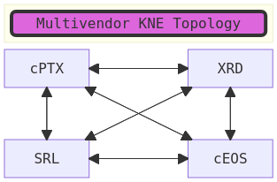

# Testing KNE

First [Install KNE](INSTALL.md).

## Default KNE router image names:

- `ceos:latest`
- `cptx:latest`
- `xrd:latest`
- `ghcr.io/nokia/srlinux:latest`

## Launching example topology

```bash
kne create multivendor.pb.txt
```



```bash
$ kne create multivendor.pb.txt
I0128 09:59:28.322457    4286 topo.go:174] Trying in-cluster configuration
I0128 09:59:28.322790    4286 topo.go:177] Falling back to kubeconfig: "/home/nleiva/.kube/config"
I0128 09:59:28.323847    4286 topo.go:453] Adding Link: ceos:eth1 xrd:eth1
I0128 09:59:28.323864    4286 topo.go:453] Adding Link: ceos:eth2 xrd:eth2
I0128 09:59:28.323867    4286 topo.go:453] Adding Link: ceos:eth3 xrd:eth3
I0128 09:59:28.323870    4286 topo.go:453] Adding Link: ceos:eth4 cptx:eth5
...
I0128 10:03:00.988145    4286 topo.go:691] Node "ceos" (vendor: "ARISTA", model: "ceos"): Status RUNNING
I0128 10:03:00.990865    4286 topo.go:691] Node "cptx" (vendor: "JUNIPER", model: "cptx"): Status RUNNING
I0128 10:03:00.994562    4286 topo.go:691] Node "srl" (vendor: "NOKIA", model: "ixrd2"): Status RUNNING
I0128 10:10:48.592066    4286 cisco.go:503] Cisco xrd node xrd status is RUNNING 
I0128 10:10:48.592093    4286 topo.go:691] Node "xrd" (vendor: "CISCO", model: "xrd"): Status RUNNING
I0128 10:10:48.692375    4286 topo.go:292] Topology "multivendor" created
Log files can be found in:
    /tmp/kne.dev-10-34-21-181.nleiva.log.INFO.20250128-095928.4286
```

```bash
$  kubectl get pods -n multivendor  
NAME   READY   STATUS    RESTARTS   AGE
ceos   1/1     Running   0          85m
cptx   1/1     Running   0          85m
srl    1/1     Running   0          85m
xrd    1/1     Running   0          85m
```

### Arista

#### Import container image

```bash
docker import cEOS64-lab-4.28.0F.tar ceos:4.28
```

#### Connecting to CLI

`kubectl exec -it ceos -n multivendor -- Cli`

```bash
$ kubectl exec -it ceos -n multivendor -- Cli
Defaulted container "ceos" out of: ceos, init-ceos (init)

r1>show version
Arista cEOSLab
Hardware version: 
Serial number: 
Hardware MAC address: 0272.9d59.c705
System MAC address: 0272.9d59.c705

Software image version: 4.28.0F-26924507.4280F (engineering build)
...
```

```bash
ceos#show isis neighbors 
 
Instance  VRF      System Id        Type Interface          SNPA              State Hold time   Circuit Id          
default   default  ios              L2   Port-Channel1      P2P               UP    14          00                  
default   default  ios              L2   Ethernet3          P2P               UP    12          00                  
default   default  srl              L2   Ethernet9          P2P               UP    25          00  
```

```bash
ceos#show ip bgp summary 
BGP summary information for VRF default
Router identifier 2.2.2.1, local AS number 100
Neighbor Status Codes: m - Under maintenance
  Neighbor   V AS           MsgRcvd   MsgSent  InQ OutQ  Up/Down State   PfxRcd PfxAcc
  2.2.2.2    4 100                0         0    0    0 01:51:11 Connect
  2.2.2.3    4 100              113       134    0    0 01:49:38 Estab   6      6
  2.2.2.4    4 100                0         0    0    0 01:51:11 Connect
  10.10.10.1 4 1000               0         0    0    0 01:51:11 Active
```

Applying a config:

```bash
$ kne topology push 4vendors/multivendor.pb.txt ceos 4vendors/ceos.cfg
...
I0203 12:54:14.190838   17623 arista.go:292] ceos - pushing config
I0203 12:54:15.730091   17623 arista.go:316] ceos - finished config push
Log files can be found in:
    /tmp/kne.dev-10-34-21-181.nleiva.log.INFO.20250203-125414.17623
```

### Cisco

#### Import container image

```bash
$ tar -xvzf xrd-control-plane-container-x86.7.8.1.tgz 
...
./xrd-control-plane-container-x64.dockerv1.tgz
./xrd-control-plane-container-x64.dockerv1.tgz.signature
```

```bash
docker load -i xrd-control-plane-container-x64.dockerv1.tgz
```

#### Connecting to CLI

`kubectl exec -it xrd -n multivendor -- /pkg/bin/xr_cli.sh`

```bash
$ kubectl exec -it xrd -n multivendor -- /pkg/bin/xr_cli.sh
Defaulted container "xrd" out of: xrd, init-xrd (init)

User Access Verification

Username: cisco
Password: cisco123

Tue Jan 28 21:36:17.946 UTC
Cisco IOS XR Software, Version 7.8.1 LNT
Copyright (c) 2013-2022 by Cisco Systems, Inc.

...
```

```bash
RP/0/RP0/CPU0:ios#show isis nei
Mon Feb  3 18:18:48.747 UTC

IS-IS default neighbors:
System Id      Interface        SNPA           State Holdtime Type IETF-NSF
srl            Gi0/0/0/8        *PtoP*         Up    25       L2   Unable  
ceos           BE1              *PtoP*         Up    12       L2   Capable 
ceos           Gi0/0/0/2        *PtoP*         Up    13       L2   Capable 
```

```bash
RP/0/RP0/CPU0:ios#ping 1.2.0.1 
Tue Jan 28 21:37:17.144 UTC
Type escape sequence to abort.
Sending 5, 100-byte ICMP Echos to 1.2.0.1 timeout is 2 seconds:
!!!!!
Success rate is 100 percent (5/5), round-trip min/avg/max = 1/1/3 ms
RP/0/RP0/CPU0:ios#
```

### Juniper

#### Import container image

You need to load the image with `docker load -i` instead of `docker import`.

```bash
-i, --input		Read from tar archive file, instead of STDIN
```

#### Connecting to CLI

```bash
$ kubectl exec -it cptx -n multivendor -- cli
Defaulted container "cptx" out of: cptx, init-cptx (init)

root@re0> show version 
Hostname: re0
Model: ptx10001-36mr
Junos: 23.2R2.11-EVO
Yocto: 3.0.2
Linux Kernel: 5.2.60-yocto-standard-g3c005ea
JUNOS-EVO OS 64-bit [junos-evo-install-ptx-fixed-x86-64-23.2R2.11-EVO]
```

#### Nokia

#### Import container image

`docker pull ghcr.io/nokia/srlinux` :clap

#### Connecting to CLI

 `kubectl exec -it srl -n multivendor -- sr_cli` 

```bash
$ kubectl exec -it srl -n multivendor -- sr_cli
Defaulted container "srl" out of: srl, init-srl (init)
Using configuration file(s): ['/etc/opt/srlinux/srlinux.rc']
Welcome to the srlinux CLI.
Type 'help' (and press <ENTER>) if you need any help using this.
--{ running }--[  ]--
...
```

```bash
A:srl# show adjacency
-----------------------------------------------------------------------------------------------------------------------------------------------------------------------------------------------------------------------------------------------------------------------------------------
Network Instance: DEFAULT
Instance        : i1
Instance Id     : 0
+----------------+--------------------+-----------------+------------+--------------+-------+--------------------------+--------------------+
| Interface Name | Neighbor System Id | Adjacency Level | Ip Address | Ipv6 Address | State |     Last transition      | Remaining holdtime |
+================+====================+=================+============+==============+=======+==========================+====================+
| ethernet-1/3.0 | 0102.4308.2191     | L2              | 1.2.0.9    | ::           | up    | 2025-02-03T18:13:29.700Z | 15                 |
| ethernet-1/6.0 | 0102.4308.2194     | L2              | 1.2.2.1    | ::           | up    | 2025-02-03T18:13:27.300Z | 15                 |
+----------------+--------------------+-----------------+------------+--------------+-------+--------------------------+--------------------+
Adjacency Count: 2
-------------------
```

The following to apply a config doesn't work for SR Linux:

```bash
kne topology push 4vendors/multivendor.pb.txt srl 4vendors/srlinux.cfg
```

(*) Need to add service definitions to enable SSH, etc.: https://github.com/openconfig/kne/blob/main/examples/nokia/srlinux-cert/2node-srl-with-cert.pbtxt

## Troubleshoot

### XRD not loading

```bash
Validating fs.inotify.max_user_instances constraint for node "xrd" (vendor: "CISCO", model: "xrd")
Error: failed to create topology "multivendor": failed to validate node "xrd" (vendor: "CISCO", model: "xrd"): failed to validate kernel constraint error: invalid bounded integer constraint. min: 64000 max 9223372036854775807 constraint data 128
Log files can be found in:
    /tmp/kne.dev-10-34-21-181.nleiva.log.INFO.20250128-093511.1077012
```

->
My first deploy attempt failed due to lack of inotify resources. Deploy worked after bumping inotify up to 65k:

```bash
cat /proc/sys/fs/inotify/max_user_watches
echo fs.inotify.max_user_watches=65536 | sudo tee -a /etc/sysctl.conf && sudo sysctl -p

cat /proc/sys/fs/inotify/max_user_instances
echo fs.inotify.max_user_instances=65536 | sudo tee -a /etc/sysctl.conf && sudo sysctl -p
```

### Disk space

```bash
sudo rm /var/crash/*
```